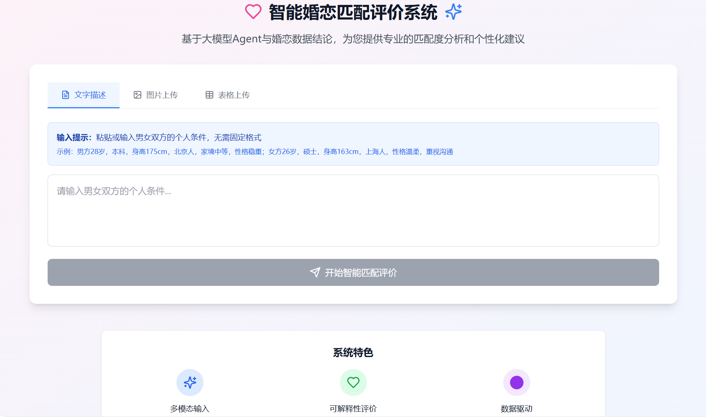
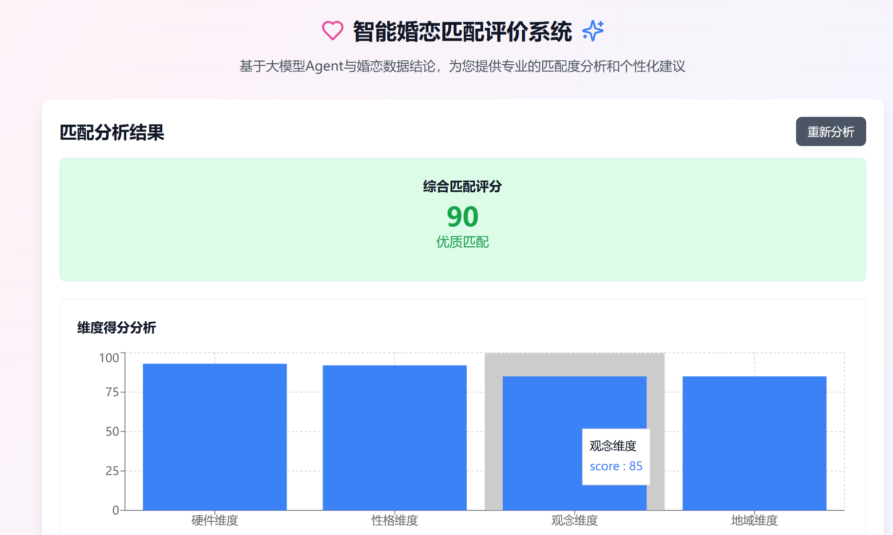
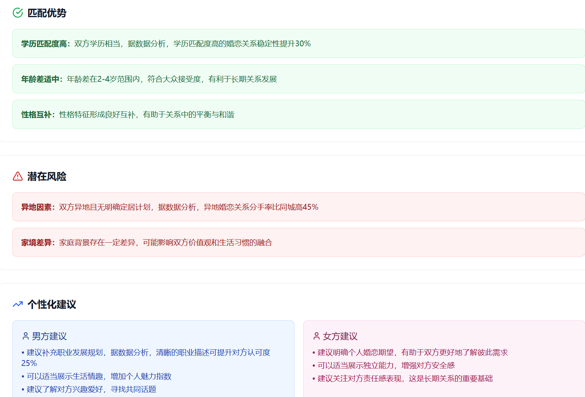

**祝你找到心仪的那个人！💕**

版本：1.0.0 | 更新：2026年 | 基于Python 3.8+
=======
# 💘 基于大模型Agent的婚恋匹配评价系统
### 三合一产品：婚恋匹配评价 + AI智能体 + 真实数据分析结论

---

## 📌 项目介绍
本项目基于真实婚恋数据构建匹配规则库，结合大模型AI Agent智能体，实现**多模态输入、自动信息抽取、数据驱动匹配评分、可解释婚恋建议**。
不是普通匹配工具，而是**基于社会真实数据的AI婚恋顾问**。

---

## 🌟 项目亮点
- ✅ **多模态输入**：支持文字粘贴 + 图片上传（相亲表/征婚图）
- ✅ **AI智能信息抽取**：自动提取年龄、学历、身高、家境、性格、观念
- ✅ **数据驱动打分**：0-100分综合匹配度 + 4大维度细分评分
- ✅ **可解释评价**：明确说明为什么分高/分低，依据社会婚恋数据
- ✅ **专业建议**：匹配优势、潜在风险、个性化改善方向

---

## 🖼️ 项目可视化展示（直接点开就能看到效果）

### 1. 主界面（多模态输入）

### 2. 匹配结果页（可视化评分+报告）

---

## 🎯 功能清单
### 1. 输入方式
- 文字输入：直接粘贴男女双方条件，无需固定格式
- 图片上传：上传征婚图/相亲表，AI自动抽取信息

### 2. AI Agent 核心能力
- 信息抽取：自动识别年龄、学历、身高、城市、家境、性格、观念、职业
- 匹配度计算：基于真实婚恋数据规则，精准打分
- 可解释评价：说明高/低分原因，结合社会接受度
- 个性化建议：优势强化、风险避坑、改善方向

### 3. 输出结果
- 综合匹配评分（0-100分）
- 4大维度得分：硬件｜性格｜观念｜地域
- 匹配优势（3-5条）
- 潜在风险预警
- 男女双方专属建议

---

## 📊 技术栈
- 大模型：通义千问
- AI Agent：智能规则引擎 + 函数调用
- 多模态：图片信息抽取
- 界面：零代码平台搭建可视化Demo
- 数据：真实婚恋数据分析规则库

---

## 👨‍💻 作者
Clara-0319
